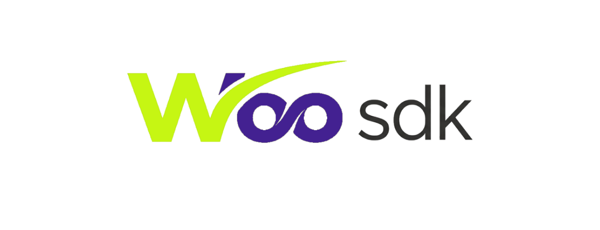

# woosdk

⚠️ Note: Make sure to update the chain-id and the sequencer address. The sequencer address will be the same one used in the bridge for now.

We also added support for L1 to L3 deposits via the CLI.

The easiest way to run a test of our SDK is using Docker.
```bash
git clone https://github.com/riquelima805/woosdk.git
```

```bash
cd woosdk
```

```bash
docker compose up --build
```

To create a new network via Docker:

```bash
docker compose --profile cli run --rm cli node cli.mjs full --chain-id 1988 --gas-token-id 1
```

Replace 1988 with your network ID and remember to update the sequencer address in .env.test

To make a deposit from L1 to L3 via the CLI:

docker compose --profile cli run --rm cli node cli.mjs bridge-in --chain-id 1988 --token-id 0 --amount 1000 --receiver aleo1YOUR_ADDRESS_HERE

new L1 bridge depoit: 

```bash
docker compose --profile cli run --rm cli node cli.mjs bridge-in --chain-id 1876 --token-id 0 --amount 1000 --receiver aleo1RECEPTOR_AQUI
```

⚠️ You will always need to deploy the DeFi contract and wanpedleo for the wallet to work properly. Both are located in the /aleo programs.




EN


WooSDK is a solution for developers to create Layer 3 networks in a
simplified way on top of the Aleo network.

SDK Structure

Genesis Contract (L1): Responsible for anchoring batches, managing
staking, and handling the bridge.

L3 Node: Maintains the local Layer 3 state and acts as the network
sequencer.

ZK Prover: Generates and verifies Zero-Knowledge Proofs for
transactions.

CLI: Command-line tool used to manage and create new chains.

Wallet: Interface to interact with the L3, with support for custom RPC,
transfers, DEX, and contract deployment.

Requirements

Node.js: v18+ (nodejs.org)

Rust: v1.70+ (rustup.rs)

Leo: ≥ v2.0.0 (developer.aleo.org/leo)

Note: add the Leo executable to your PATH.

Installation

```bash
    git clone https://github.com/riquelima805/woosdk.git
    cd woosdk
    npm install
```

Install the dependencies.

Inside woosdk:

```bash
    npm install
```

Install the Wallet dependencies

```bash
    cd woo-wallet
    npm install
```

Prepare the ZK-Prover:

```bash
    cd ../zk-prover
    cargo build
```

Environment Setup: Return to the root folder (woosdk) and add your
private key to the .env file. You need Testnet credits. Get them here:
faucet.aleo.org

Deploy the Network via CLI: This command will deploy the system, mint
the initial gas token, and activate the network.

```bash
    node cli.mjs full --chain-id 888 --gas-token-id 1 --sequencer <SEQUENCER_ADDRESS>
```

Important: Change the chain-id and the sequencer address. The sequencer
address will be the same one used as the bridge Vault.

Run the Services:

RPC: In a terminal at the root folder: 
```bash
npx tsx src/rpc.ts
```

ZK-Prover: In a terminal inside woosdk/zk-prover: 
```bash
cargo run –release
```

Wallet: In a terminal inside woo-wallet: 
```bash
npm run dev
```

Testing the Features

Tokens and DeFi: In the wallet, you can deploy test tokens and call the
mint function. In the DeFi section, you can add two tokens (X and Y),
deposit them, and call the contract liquidity function. Currently, the
Vault supports two tokens.

Bridge (L1 → L3): To send Aleo Testnet to the L3 (generating Wrapped
Aleo), use the command inside the templates folder of your genesis
contract:

```bash
    leo execute bridge_in 2011u64 1u64 5000000u64 <L1_RECEIVER_ADDRESS> <VAULT_ADDRESS> --broadcast --network testnet --endpoint "https://api.explorer.aleo.org/v1/testnet3" --private-key "YOUR_KEY"
```

Development Notes

Currently, the bridge accepts any address as a Vault; this will be
restricted in future updates.

For now, the RPC only accounts for data provided by the owner as the
Vault.

The implementation of authentication (Auth) on the L3 is still under
developme


PT-BR

⚠️ Aviso: Altere o chain-id e o endereço do sequenciador. O endereço do sequenciador será o mesmo utilizado na bridge por enquanto.

Também adicionamos suporte a depósitos da L1 para L3 pelo CLI.

A forma mais fácil para rodar um teste do nosso SDK é utilizando o Docker.

```bash
git clone https://github.com/riquelima805/woosdk.git
```

```bash
cd woosdk
```

```bash
docker compose up --build
```

Isso rodará apenas o terminal RPC com provas "fake", apenas para teste.

Para criar uma nova rede pelo Docker:

```bash
docker compose --profile cli run --rm cli node cli.mjs full --chain-id 1988 --gas-token-id 1
```

deposito L1 para l3:

new L1 bridge depoit: 

```bash
docker compose --profile cli run --rm cli node cli.mjs bridge-in --chain-id 1876 --token-id 0 --amount 1000 --receiver aleo1RECEPTOR_AQUI
```

Substitua 1988 pelo ID da rede e lembre-se de alterar o endereço do sequenciador no .env.test

Para fazer um depósito da L1 para a L3 pelo CLI:

docker compose --profile cli run --rm cli node cli.mjs bridge-in --chain-id 1988 --token-id 0 --amount 1000 --receiver aleo1SEU_ENDERECO_AQUI

⚠️ Precisará sempre fazer upload do contrato da DeFi e do wanpedleo para melhor funcionamento da wallet. Ambos estão na pasta /aleo programs.


PT - BR

WooSDK é uma solução para desenvolvedores criarem Layer 3 de forma simplificada sobre a rede Aleo.

Estrutura do SDK

Contrato Gênesis (L1): Responsável por ancorar os lotes, gerenciar o staking e realizar a ponte.

Nó L3: Mantém o estado local da Layer 3 e atua como o sequenciador da rede.

ZK Prover: Gera e verifica as provas de conhecimento zero (Zero-Knowledge Proofs) para as transações.

CLI: Ferramenta de linha de comando para gerenciar e criar novas chains.

Wallet: Interface para interagir com a L3, com suporte a RPC customizado, transferências, DEX e deploy de contratos.


requisitos

Node.js: v18+ (nodejs.org)

Rust: v1.70+ (rustup.rs)

Leo: ≥ v2.0.0 (developer.aleo.org/leo)

Nota: adicione o executável do Leo ao seu PATH.


instalar

```bash
git clone https://github.com/riquelima805/woosdk.git
cd woosdk
npm install
```

Instale as dependências. 

em woosdk:

```bash
npm install
```

Instale as dependências da Wallet

```bash
cd woo-wallet
npm install
```

Prepare o ZK-Prover:

```bash
cd ../zk-prover
cargo build
```

Configuração de Ambiente:
Retorne à pasta raiz (woosdk) e adicione sua chave privada no arquivo .env.
Você precisa de créditos na Testnet. Obtenha-os aqui: faucet.aleo.org


Implementar a Rede via CLI:
Este comando irá implementar o sistema, realizar o mint da moeda de gas inicial e ativar a rede.

```bash
node cli.mjs full --chain-id 888 --gas-token-id 1 --sequencer <ENDEREÇO_DO_SEQUENCER>
```

Importante: Mude o chain-id e o endereço do sequencer. O endereço do sequencer será o mesmo utilizado como Vault da ponte.


Rodar os Serviços:


RPC: Em um terminal na raiz: npx tsx src/rpc.ts

ZK-Prover: No terminal em woosdk/zk-prover: cargo run --release

Wallet: No terminal em woo-wallet: npm run dev


Testando as Funcionalidades

Tokens e DeFi: Na wallet, você pode fazer deploy de tokens de teste e chamar a função mint. Na seção DeFi, é possível adicionar dois tokens (X e Y), depositar e chamar a função de liquidez do contrato. Atualmente, o Vault suporta dois tokens.

Bridge (L1 → L3):
Para enviar Aleo Testnet para a L3 (gerando Wrapped Aleo), utilize o comando na pasta templates do seu contrato gênesis:

```bash
leo execute bridge_in 2011u64 1u64 5000000u64 <ENDEREÇO_L1_RECEBER> <ENDEREÇO_VAULT> --broadcast --network testnet --endpoint "https://api.explorer.aleo.org/v1/testnet3" --private-key "SUA_CHAVE"
```

Observações de Desenvolvimento

Atualmente, a bridge aceita qualquer endereço como Vault; isso será restrito em atualizações futuras.

O RPC, por enquanto, contabiliza apenas os dados passados pelo proprietário  como Vault.

A implementação de autenticação (Auth) na L3 ainda está em desenvolvimento.

 


